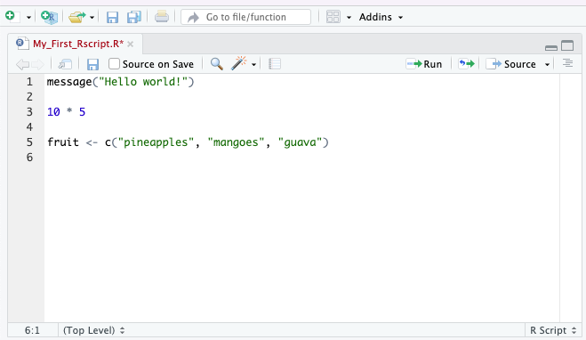

<style type="text/css">

body, td {
   font-size: 18px;
}
code.r{
  font-size: 14px;
}
pre {
  font-size: 14px
}
</style>

*This is the course handbook for WolfWorks: An introduction to R.*

***

Objectives:

1. Describe the purpose of the RStudio Script, Console, Environment, and Plots panes.
2. Understand the concepts of absolute and relative file paths, and the purpose of a working directory.
3. Use the built-in RStudio help interface to search for more information on R functions.

***

## What are R and RStudio? 

The term [R](https://www.r-project.org) refers to two things: (1) the programming
language itself and (2) the software which interprets scripts written in the R
language.

RStudio, which has now been re-branded as [Posit](https://posit.co), is an 
integrated development environment (IDE) which provides a user-friendly way to 
interact with the R software. To function correctly, RStudio needs R so both 
must be installed on your computer. 

For additional information about RStudio please see the [RStudio IDE Cheat Sheet](https://raw.githubusercontent.com/rstudio/cheatsheets/main/rstudio-ide.pdf).
<br>
<br>

### Why use R?

There are many benefits to using R: 

* R scripts are written in a linear manner, which makes the steps of your data analysis clear to both you and anyone else who should need to read it
* R code is great for reproducibility because the same results are obtained when using the same code to analyse the same data - this is increasingly a requirement for many journals and funding agencies
* R can integrated with other tools to generate manuscripts, PDF files and websites 
* R is interdisciplinary and extensible with thousands of packages developed for specific analysis requirements e.g., image analysis, population genetics, GIS etc.
* R works on data of all shapes and sizes - once you can use R, it will make very little difference if your working with a small dataset (<100 entries) or huge dataset (millions of entries)
* R is free, open-source and cross-platform
* R has a large and welcoming community - lots of help is available online [see below]


***


## The RStudio IDE

In order to begin using R, we first need to know our way around [RStudio](https://posit.co). 
RStudio consists of four "Panes": 

1. The R **console** - for executing code
2. The **source** - for scripts and documents
3. The **environment** - for storing R objects from the current session
4. The **files, plots & help** pane - various functions
<br>
<br>
These panes can be re-organised (relative size and position) to suit your working
needs. To do this you can see `Tools -> Global Options -> Pane Layout`.
<br>
<br>
**Some definitions**

There is a certain terminology that is used when talking about using R. We will 
be using these key terms throughout the workshop: 

* The term *code* can be used both to refer to the process of writing instructions in R and to the written instructions themselves
* We call each individual instruction a *command*
* To tell our computer system to follow the instructions, we *execute* or *run* the *commands*
<br>
<br>
**The R console**

By default, the R console appears in the bottom left-hand pane of your RStudio
window. The console is the direct interface for the R programme. This is where
commands are executed from. 


```{r, echo = FALSE, fig.align = "center", out.width = "80%"}

```

<br>
We can type any command directly into the console and execute it by pressing 
`Enter`. Any output from the command will be displayed below it in the console.
For example, we could use this area like a calculator. For example:


```{r}
56 + 44
```


By typing our command and pressing `Enter`, we have executed the code. Below we
see two pieces of information. The first and most obvious output is the answer 
to the mathematical query that we executed - 100. In front of this we see `[1]`.
To demonstrate what this `[1]` means, let's execute the following code:


```{r}
1:50
```


This command tells R to give us all numbers between `1` and `50`, which it does.
This time we have `[1]` and on the second line `[26]`. These numbers are R helping
us to keep track of what number output we are looking at. This is particularly
useful when the output of a command is long. R has told us that the second line
starts with output number `26`. 

If R is ready to accept commands for execution, you will see the `>` prompt on 
the left hand side of the console. If R is in the middle of running something 
else and is not yet ready for more code, you will see a small red symbol appear
at the top right-hand side of the pane. Once R has finished executing and is
ready again, a new `>` prompt will appear. In some cases you may see a `+` prompt
after attempting to execute a command. This means that the code you are trying to
execute is unfinished in some way, for example missing a bracket (the most 
common explanation). If this happens, you can either provide the missing code by
typing the `)` and pressing `Enter`, or you can press `Esc` to cancel the 
execution, correct the code and try again.

To clear the console we can use `Control + L`. However, once the information
stored on the console is cleared we will no longer have access to it. There is no 
reversing this clearance. Similarly, when we close RStudio and re-open it later, 
the console will automatically clear and none of our work will be saved.
<br>
<br>

**The source and R scripts**

Since code that is written and executed directly from the console cannot be 
saved, RStudio provides an alternative, more reproducible way to interact with R.
Instead of writing in the console, we can use a **script**. A script is a plain 
text file in which we can write code and, most importantly, save code. An R 
script is written in the source pane, which by default is in the top left-hand
pane of your RStudio window.


```{r, echo = FALSE, fig.align = "center", out.width = "80%"}

```


We can write our commands in the script in the same way that we did when using
the console. We can then save this script as a file on our computer meaning that
we can open it and re-run the code to get the exact same outputs. 

When writing code into a script, the code will not automatically be executed. 
Instead, we need to pass the commands to the console to be run. To do this we
use `Control + Enter` (you can also use `Cmd + Return` if you are using a Mac).
As before, the code is then executed from the console and any outputs will be
displayed there too. This means that the outputs of our script will not be 
saved, but the code to generate these outputs will be.

**_Note:_**
Whilst we choose to write the bulk of our code in scripts so that it can be 
saved, there are some instances in which we may still want to use the console. 
For example, if we are just checking the name of an object (we will get onto
objects in a minute) or the size of a variable (we'll talk about variables too).
Essentially, the **script** is for permanent code which we wish to save and 
re-run, the **console** is for temporary code which we only need in that moment.
<br>
<br>

**The RStudio environment**

The third pane in the top right-hand corner of the RStudio window has multiple
tabs. We will only discuss the **Environment** tab, as this is arguably the 
most important and widely used. 

The Environment keeps track of R objects and variables which have been created 
during the RStudio session (i.e., since opening RStudio). We will discuss this
more later. 
<br>
<br>

**Files, Plots & Help**

The final pane that you see in the bottom right-hand side of your RStudio 
window again contains several tabs. 


***


## What is a working directory?

Your working directory is the location on your computer where R will default to 
when reading or writing files. You can check where your current working directory
is by typing `getwd()` into your console and executing. 


```{r}
getwd()
```


You can think of your working directory as a room in which R is sat. When you 
want R to fetch something from your computer, a data file for example, you have
to give R a path to get to there and this path needs to start from where R 
already is i.e., your working directory. For example, if I wanted to load the 
"" file from within my "data" folder, I'd need to tell R to first go into "data", 
then grab "". Hence, the relative path would look like this: 

`"data/filename"`
<br>

Alternatively, if I want to access a file that is not below my working directory 
in the file (i.e., I need to go leave the room to find another door), I can use
`../` to mean go up one level. For example, if I wanted to access another folder
within "repos", I would need to leave the "Wolfson_Intro_R" room (which is my 
current working directory) and enter "repos", so my filepath would be:

`"../repos"`
<br>

These are what we call **relative file paths** - the file path is given relative
to our **working directory**. The alternative is to provide an **absolute file path**,
which starts at the highest point in your computer system. For example, to access
my "" file via an absolute path I would use:

`"/Users/User/repos/Wolfson_Intro_R/data/filename"`
<br>

For the rest of this course we will be using relative file paths from our 
working directory. Make sure your working directory contains a folder called 
"Data" with the relevant files in. If you wish to change your working directory
to the place where you have this folder, you can use `setwd()` and provide an
absolute file path to where the directory should be.


***


## Getting help with R

This one-day course will introduce you to many of the key concepts that are used 
in R, but is far from extensive. The best way to become proficient at R is to 
use it - frequently. Although this may seem daunting at first, there are many 
places that you can turn to for help.
<br>
<br>

**The built in RStudio help interface**

As we saw briefly above, RStudio has a `Help` tab within the bottom right-hand
pane. Here you can search for key words which relate to the problem that you're
having. 
<br>

**_I know the name of the function I want to use, but I'm not sure how to use it_**
You can use a single question mark followed by the function name to bring up the
help page for that function.


```{r}
?barplot
```


**_I know what I want to do, but I don't know which function to use to do it_**
You can use a double question mark followed by a key word and RStudio will bring
up suggestions on which function you may wish to refer to. Importantly, however,
RStudio can only search for function that exist in your installed packages.


```{r}
??kruskal
```
<br>

**Online help resources**

As with everything, if you still need help (e.g., you're getting an error 
message that you do not understand) you should first turn to google. The odds are
that someone else has already had this in the past. 

Another great place to check is [Stack Overflow](https://stackoverflow.com/questions/tagged/r) 
using the `[r]` tag. If you word your question well and are clear about what it 
is you want to do, your query will often be answered within a matter of hours. 

If possible, to increase the chances of other people being able to understand
and recreate the problem or error that you have, you should provide a small, 
simple and reproducible example of your problem. Information about how to do 
this can be found [here](http://adv-r.had.co.nz/Reproducibility.html).

