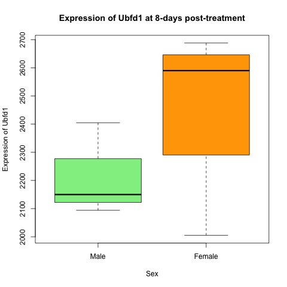

<style type="text/css">

body, td {
   font-size: 18px;
}
code.r{
  font-size: 14px;
}
pre {
  font-size: 14px
}
</style>

*This is the course handbook for WolfWorks: An introduction to R.*

***

Objectives:

1. Understand how to create a set of mappings from variables in the data to the `aesthetics` of a ggplot
2. Be aware of different geometric objects that we can add to a plot
3. Create different layers of a ggplot by using the `+` operator
4. Change the `theme` of a ggplot
5. Use faceting to display different groups of data on different plots - `facet_grid()` vs. `facet_wrap()`
6. Know how to export plots using `ggsave()`


***


## An introduction to `ggplot2`

The final part of this workshop will introduce you to key tools required for
plotting anda data visualisation. Why is data visualisation important?

* Contributes to decision-making during analysis e.g., plotting residuals can indicate whether a statistical test is appropriate or not
* Allows the user to understand their data better and be confident in their processing and analysis
* Can help to identify when something has gone wrong i.e., if a plot does not look as expected 
* Ultimately, data is published in a visual form and figures are one of the first things that a researcher will look at in a paper

The `ggplot2` package makes it simple to create publication-quality figures from
data stored in a `data.frame` or `tibble`. As a note, the `2` in `ggplot2` 
simply refers to the fact that this is the most up-to-date version of the package.
<br>

We will cover the main points needed to use `ggplot2`, but for additional 
information see the [Data Visualisation Cheat Sheet](https://carpentries-incubator.github.io/bioc-intro/40-visualization.html).
<br>
<br>

**The grammar of graphics in `ggplot`**

The main function within the `ggplot2` package is `ggplot()` - this is what we 
will use to create our visualisations. The theoretical foundation that supports
the use of `ggplot2` is the *Grammar of Graphics* (what the gg stands for).
This is the idea that you can build every graph from the same three components:

1. A data set - either a `data.frame` or `tibble`. Of note, `ggplot2` functions like data in a [long format](https://www.statology.org/long-vs-wide-data/).
2. A coordinate system - provided by mapping variables to visual properties of objects in the plot, termed **aesthetics**
3. A `geom` to specify the type of plot required 
<br>

In terms of code, this looks like:

`ggplot(data = <DATA>, mapping = aes(<MAPPINGS>)) + <GEOM_FUNCTION>`

Let's deal with these three components one at a time. 
<br>
<br>

#### 1. The data set

The first argument that we pass to the `ggplot()` function is `data =`. We use
this to specify our `data.frame` or `tibble`. If we are piping data into the 
`ggplot()` function, then we do not need to specify the `data =` argument.


```{r}
ggplot(data = rna_tbl)
```


If we execute this code by itself, what we see is that a plotting pane has 
been opened.
<br>
<br>

#### 2. Aesthetics mappings

We now need to specify **aesthetics mappings**. This will tell the `ggplot()`
function how we want to map variables within our data to visual aspects. The
aesthetic mappings take properties of our data and use them to determine visual
characteristics such as *position*, *colour*, *size*, *shape*, or *transparency*
The most simple aesthetic mapping is defining which variables to put on our x- 
and y-axes.


```{r}
ggplot(data = rna_tbl,
       aes(x = time, y = expression))
```


We now see that these variables appear on our plot.
<br>
<br>

#### 3. Specifying geometric shapes via `geoms`

Finally, we tell `ggplot()` what type of plot we are trying to create. This 
requires us to specify what **geometric objects** we want on the plot - *lines*, 
*points*, *bars*, *boxplots* etc. We do this by using the `+` operator to add
one of the following `geoms` to our plot:

* `geom_point` - for individual points (i.e., scatter plot)
* `geom_line` - for lines
* `geom_smooth` - for smoothed lines (e.g., simple trends)
* `geom_bar` - for bar charts
* `geom_histogram` - for binned values
* `geom_boxplot` - for boxplots
<br>

Other `geoms` you may wish to explore:

* `geom_text` - add text directly to the plot
* `geom_label` - add text to directly to the plot (with a rectangle underneath giving a label-look)


```{r}
ggplot(data = rna_tbl,
       aes(x = time, y = expression)) + 
  geom_point()
```


The plot above is not particularly useful. Firstly, we have time points 2- and
6-days, which do not exist in our data. This is because `time` is currently a
numeric variable, meaning that R treats it as continuous. In reality, we want
to plot time as a factor with three categories - 0, 4 and 8-days post-treatment.
Secondly, there are so many genes that we cannot really see the distribution of
expression values. This plot would be much better suited as a boxplot. Let's
try to correct these two things.


```{r}
rna_tbl %>%
  mutate(time = factor(time)) %>%
  ggplot(aes(x = time, y = expression)) +
  geom_boxplot()
```


Hmm, this still is not really what we want. Our data is so skewed that the 
distributions are difficult to see. One trick that is often used in such cases
is to log the data in our plot.


```{r}
rna_tbl %>%
  mutate(time = factor(time)) %>%
  ggplot(aes(x = time, y = log(expression))) +
  geom_boxplot()
```
<br>
This looks better. We also get a warning tell us that some values were removed. 
These are the `NA` expression values in our data.  
<br>

We can also add multiple `geoms` to a single `ggplot`. 

```{r}
rna_tbl %>%
  mutate(time = factor(time)) %>%
  ggplot(aes(x = time, y = log(expression))) +
  geom_jitter(alpha = 0.2, color = "tomato") +
  geom_boxplot(alpha = 0) 
```
<br>
When we plot multiple `geom` we need to be aware of the order in which we plot 
them. Whatever we plot first will end up at the back as `ggplot` and then new
`geom`s are plotted on top. This is important to remember, for example if we 
want to use `geom_text` or `geom_label` to plot text or labels onto our plots.
<br>
<br>

**Challenge: Using the Grammar of Graphics**  
Create the same plot as you produced previously in base-R, but this time using
only `tidyverse` and `ggplot2` functions. The plot is showing the expression of 
Ubfd1 at 8-days post-treatment in male and female mice. 

```{r, echo = FALSE, fig.align = "center", out.width = "100%"}

```
<br>

<details>  
<summary>Solution</summary> 
<br>

```{r}
rna_tbl %>%
  filter(gene == "Ubfd1" & time == 8) %>%
  mutate(sex = factor(sex, levels = c("Male", "Female"))) %>%
  ggplot(aes(x = sex, y = expression, fill = sex)) +
  geom_boxplot() + 
  scale_fill_manual(values = c("lightgreen", "orange")) +
  xlab("Sex") +
  ylab("Expression of Ubfd1") +
  ggtitle("Expression of Ubfd1 at 8-days post-treatment") +
  theme_bw() 
```


</details>
<br>


***


## More details about aesthetics - in the plot vs. in the layers

As we discovered above, aesthetics can be mapped to the plot such that the plot
visuals are dependent upon some variable in our data. This can include specifying
which variables determine the x and y coordinates (or in some cases only one of 
these e.g., histograms only require an x variable as the y coordinate automatically
represents frequency). In the example above we saw that we can also have data
variables determining the colour of our plots.

Other aesthetic variables that can be altered:

* point shape: `shape`
* point size: `size` `
* line type: `line_type` 
* line width: `size`  
* transparency: `alpha` 
<br>

Any aesthetics that are specified in the initial plot layer will be applied to 
all `geoms` that are added. For example, `ggplot(aes(alpha = 0.2))` would make
all `geoms` somewhat transparent. However, aesthetics can also be specified 
within specific `geom` layers so that they are only applied to these layers
rather than universally.
<br>


***


## Using themes in `ggplot2`

Another aspect of `ggplot2` is themes - these include all non-data elements
that you can control. Examples include text size, plot background colour, the
presence or absence of grid lines, legend position etc. As with all of the 
other elements that we have come across so far, we add theme elements using the
`+` operator. If we don't specifically add these elements, the plot will simply
use all of `ggplot2`'s defaults, which is what we did above.  
<br>

Several themes exist in the `ggplot2` package:

* `theme_grey()`
* `theme_bw()`
* `theme_light()`
* `theme_dark()`
* `theme_minimal()`
* `theme_classic()`
<br>

Let's try some of these out using the same plot as above:


```{r, warning = FALSE}
## Adding black and white theme
rna_tbl %>%
  mutate(time = factor(time)) %>%
  ggplot(aes(x = time, y = log(expression))) +
  geom_boxplot() +
  theme_bw()
```


```{r, warning = FALSE}
## Adding dark theme
rna_tbl %>%
  mutate(time = factor(time)) %>%
  ggplot(aes(x = time, y = log(expression))) +
  geom_boxplot() +
  theme_dark()
```
<br>

We can also install other themes from other packages. There is even a package
that includes `ggplot` themes based on films - [`ThemePark`](https://github.com/MatthewBJane/ThemePark).

<br>
***

## Faceting 

Another really useful feature that `ggplot2` gives us is **faceting**. Faceting
lets us split a plot into subplots, or *facets*, based on a factor (categorical
variable) within our dataset.

There are two faceting functions:

1. `facet_wrap()` = only creates plots for the combinations of variables that have values by "wrapping" these plots into 2d panels
2. `facet_grid()` = creates a grid of plots for each combination of variables specified, even if these do not have values


Let's get some data to plot. Create a new `tibble` called `plotting_data` that
contains the median expression value for each gene at each time. 


```{r}
plotting_data <- rna_tbl %>%
  filter(gene %in% rna_tbl$gene[1:10]) %>%                      # Take the top 10 gene names only
  group_by(time, gene) %>%
  summarise(med_exp = median(expression, na.rm = TRUE)) %>%      # Get median expression of these 10 genes at each timepoint
  select(gene, time, med_exp)                                  # Select only relevant columns

plotting_data
```


We could plot the mecian expression of each of these genes over time on a single
plot.

```{r}
plotting_data %>%
  ggplot(aes(x = time, y = med_exp)) +
  geom_line()
```
<br>

Uh oh - this is not what we wanted. We plotted the data for all genes together
rather than on a per-gene basis. To tell ggplot to give us a line per gene we
need to include the `group = gene` argument in our aesthetics.


```{r}
plotting_data %>%
  ggplot(aes(x = time, y = med_exp, group = gene)) +
  geom_line()
```
<br>

**Question**  
What argument could we include if we wanted each of the genes to have a different
coloured line? Where would this argument be specified?
<br>


Faceting allows us to create an entire plot per-gene, rather than having all of
the genes on a single plot. Let's look at the `facet_wrap` function first.

```{r}
plotting_data %>%
  ggplot(aes(x = time, y = med_exp)) +
  geom_line() +
  facet_wrap(~ gene)
```

**Question**  
What do you notice about the y-axis of these plots? 
<br>

If we wanted to allow each plot to have free scaling, we can use the `scales = "free_y"`
argument within `facet_wrap`.

```{r}
plotting_data %>%
  ggplot(aes(x = time, y = med_exp)) +
  geom_line() +
  facet_wrap(~ gene, scales = "free_y")
```
<br>
<br>

What about if we try to do the same thing but usig `facet_grid`?

```{r}
plotting_data %>%
  ggplot(aes(x = time, y = med_exp)) +
  geom_line() +
  facet_grid(.~ gene)
```
<br>
Right now we only have a one-dimensional grid because be are only faceting on a
single variable. If we wanted to see the median gene expression over time 
separately for males and females, we could `group_by` sex as well as gene and 
time. This way we can facet sex against gene and we get an even more informative
plot.

```{r}
plotting_data_2 <- rna_tbl %>%
  filter(gene %in% rna_tbl$gene[1:10]) %>%                      # Take the top 10 gene names only
  group_by(time, gene, sex) %>%
  summarise(med_exp = median(expression, na.rm = TRUE)) %>%      # Get median expression of these 10 genes at each timepoint for each sex
  select(gene, time, med_exp, sex)                               # Select only relevant columns

plotting_data_2
```


```{r}
plotting_data_2 %>%
  ggplot(aes(x = time, y = med_exp)) +
  geom_line() +
  facet_grid(sex ~ gene)
```
<br>
<br>

**Challenge: Creating complex ggplots**  
Using all of the skills we have learnt in this lesson, create a plot that shows
mean gene expression of each chromosome throughout the course of infection.

<details>  
<summary>Solution</summary> 
<br>

```{r}
rna_tbl %>%
  group_by(chromosome_name, time) %>%
  summarize(mean_exp = mean(expression)) %>%
  ggplot(aes(x = time, y = mean_exp)) + 
  geom_line() +
  facet_wrap(~ chromosome_name, scales = "free_y")
```
</details>  


